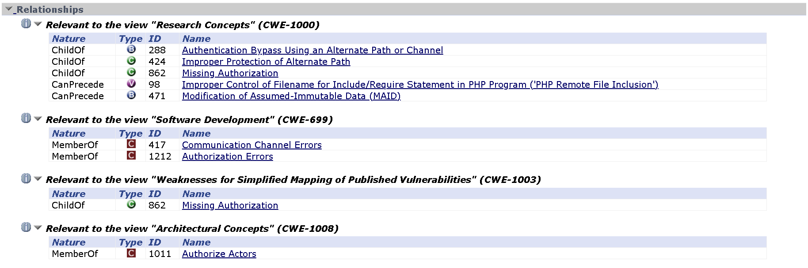
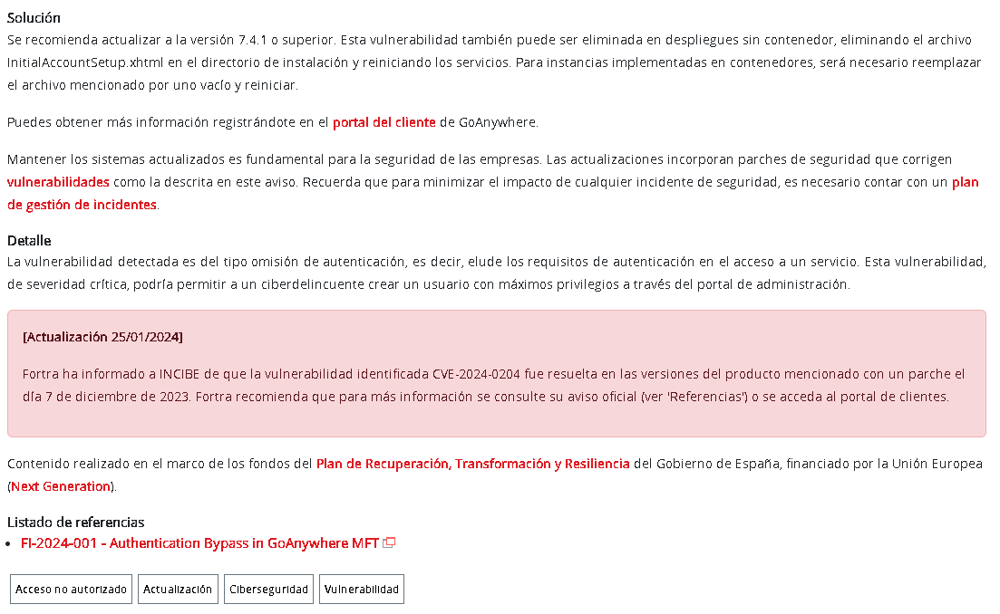

# PPS-Unidad2Actividad1-Angel

# Trazado de una vulnerabilidad.
Actividad 1 de la Unidad 2 de Puesta en Producción Segura. Tabajaremos con los Entornos de Desarrollo

Tenemos varios objetivos:

> [Conocer las diferentes listas que tienen que ver con amenazas de seguridad.](#Listas)

> [Obtener información de una vulnerabilidad navegando por las webs de los organismos que mantienen esas listas.](#Trazado)

> [Trazado de vulnerabilidad GoAnywhere MFT de Fortra](#Trazado-de-vulnerabilidad-GoAnywhere-MFT-de-Fortra)

## Listas

En el siguiente [enlace](https://moodle.educarex.es/ccff_iesvjp/pluginfile.php/27882/mod_resource/content/17/PresentacionUnidad2NivelesSeguridadAplicaciones2025.pdf) podemos acceder a la presentación donde encontramos información acerca de las organizaciones y agencias que mantienen información sobre amenazas, vulnerabilidades, debilidades, etc...

Existen diversas fuentes abiertas donde podemos consultar información sobre seguridad informática, nos centraremos en lass siguientes listas:

### Principales Listas de Seguridad

#### 1. [CVE - Common Vulnerabilities and Exposures](https://www.cve.org/)
La lista CVE proporciona un identificador único para cada vulnerabilidad conocida en software y hardware. Es mantenida por el MITRE Corporation y ampliamente utilizada por profesionales de ciberseguridad para identificar y rastrear vulnerabilidades específicas.

#### 2. [NVD - National Vulnerability Database](https://www.nist.gov/)
La NVD es la base de datos oficial administrada por el Instituto Nacional de Estándares y Tecnología (NIST). Contiene información detallada sobre las vulnerabilidades CVE, incluyendo puntuaciones de criticidad y métricas de riesgo basadas en CVSS.

#### 3. [CWE - Common Weakness Enumeration](https://cwe.mitre.org/)
El CWE es un sistema que enumera debilidades de software conocidas que pueden dar lugar a vulnerabilidades. Es utilizado para identificar y mitigar fallos de diseño y codificación en el desarrollo de software.

#### 4. [CPE - Common Platform Enumeration](https://cpe.mitre.org/)
El CPE es un esquema de nomenclatura estructurada que permite identificar software, sistemas operativos y hardware de manera única. Se utiliza en conjunto con CVE y NVD para evaluar la presencia de vulnerabilidades en plataformas específicas.

#### 5. [CAPEC - Common Attack Pattern Enumeration and Classification](https://capec.mitre.org/)
El CAPEC es una base de datos de patrones de ataque utilizada para comprender cómo se explotan las vulnerabilidades. Permite a los defensores anticipar y mitigar posibles vectores de ataque mediante el análisis de tácticas comunes empleadas por actores maliciosos.

### Información Adicional Relacionada

#### 6. [CVSS - Common Vulnerability Scoring System](https://www.first.org/cvss/)
El CVSS es un sistema de puntuación que evalúa la severidad de una vulnerabilidad en función de factores como facilidad de explotación, impacto en la confidencialidad, integridad y disponibilidad del sistema afectado.

#### 7. [MITRE ATT&CK Framework](https://attack.mitre.org/)
MITRE ATT&CK es un marco de conocimiento que documenta tácticas, técnicas y procedimientos (TTPs) utilizados por actores de amenazas en ataques cibernéticos. Es ampliamente utilizado en análisis de amenazas y defensa proactiva.

---

## Trazado
Vamos a seguir el trazado de una vulnerabilidad a partir de [este artículo del INCIBE](https://www.incibe.es/empresas/avisos/autodesk-ha-publicado-multiples-vulnerabilidades-que-afectan-autocad).

En el artículo, nos informan sobre varias vulnerabilidades presentes en la aplicación **AutoCAD**, desarrollada por **Autodesk**.
Cierto es verdad, que no proporcionan información sobre el número específico de la vulnerabilidad, sin embargo, si queremos obtener más detallas, podemos consultar el apartado de **referencias** donde nos indican una referencia del desarrollador para obtener más información sobre las vulnerabilidade identificadas en la aplicación.

Accediendo al siguiente artículo [https://www.autodesk.com/trust/security-advisories/adsk-sa-2023-0018](https://www.autodesk.com/trust/security-advisories/adsk-sa-2023-0018) nos muestran la información mencionada anteriormente. 

---

## Información sobre Vulnerabilidades
Allí vemos una descripción de los problemas y cómo son varias las vulnerabilidades detectadas:

Además el desarrollador, nos informa de los productos y versiones afectadas y desde dónde nos podemos descargar los parches de seguridad o software con las vulneravilidades ya corregidas.

Vamos a proceder con el trazado de la primera vulnerabilidad presente, en nuestro caso la __CVE-2023-29073__.

Para ver información sobre dicha vulnerabilidad podemos acudir al menos a dos fuentes:

- [La sección de CVE que mantiene cve.org.](https://cve.org)

- [La base de datos de vulnerabilidades de la NVD.](https://nvd.nist.gov/vuln/detail/CVE-2023-29073)

---

## Información sobre el riesgo o criticidad de una vulnerabilidad

Desde la [entrada correspondiente a la vulnerabilidad en la NVD](https://nvd.nist.gov/vuln/detail/CVE-2023-29073), lo primero que nos encontramos, es la información de la criticidad que la vulnerabilidad presenta, así como el vector asociado a dicho nivel en la CVSS. En este caso vemos que tiene una valoración de 9.8 y está marcada como crítica.
 

Si ponemos el cursor sobre el Vector nos aparecerán los valores correspondientes a las diferentes métricas que se han usado para calcularlo.

---

## Información sobre las debilidades explotadas.

Otra información importante a obtener son las debilidades que son explotadas. Podemos obtener también esta información tanto en la información de la NVD como en la de CVE.ORG.

En esta ocasión podemos ver como son dos las debilidades explotadas por esta vulnerabilidad: CWE-787 y CWE-122. Vamos a ver información sobre ellas.

- CWE-787

> [Podemos ver información de esta debilidad en la página de cwe.mitre.org](https://cwe.mitre.org/data/definitions/787.html)
>
> Dentro de la información mostrada en dicha página, podemos tener diferentes vistas, tal y como podemos ver en la imagen siguiente. Si le damos a __Complete__ tendremos toda la información visible.
>
> De la información mostrada, podemos extraer, que la debilidad explotada, consiste en la escritura en posiciones fuera de los límites de la memoria, y esto podría ser utilizado para modificar los datos de control, direcciones de retorno e incluso ejecutar código.
>
> Como mitigaciones que nos ofrecen es usar lenguajes donde no se produzca el desbordamiento del buffer o sea más fáciles de evitar. 
>
> También podemos ver las posibles mitigaciones que podemos efectuar en las fases de arquitectura y diseño, como utilizar diferentes librerías y métodos.
>
> Más información a obtener... por ejemplo podemos observar como son debilidades presentes en lenguajes como C y C++, por lo que seguramente la aplicación está escrita en alguno de ellos.
>
> 
>
> También, por último, podemos ver las relaciones entre ésta y otras debilidades, ya que como podemos ver en la imagen
>
> Esta debilidad ha surgido a partir de la CWE-119 y es padre de la CWE-121 y CWE-122 que es la otra debilidad presente en la vulnerabilidad que estamos estudiando.
>
>  

- CWE-122
> [Podemos ver información de esta debilidad en la página de cwe.mitre.org](https://cwe.mitre.org/data/definitions/122.html)
>
> Si leemos, podemos ver cómo nos encontramos ante la debilidad de desbordamiento de pila y que se considera una variación de la anterior debilidad, por lo que es hijo de ella.
>
> También vemos que es una debilidad presente en los lenguajes C y C++ y aquí en está página podemos encontrar la relación de esta debilidad con otro listado el de patrones de ataque. Tal y como vemos en la imagen, para acometer esta debilidad usamos el patrón de ataque catalogado como CAPEC-92.
>
> 

---

## Información sobre patrones de ataque

Podemos acceder a información sobre los patrones de ataque en la lista mantenida por la Mitre en la dirección [capec.mitre.org](https://capec.mitre.org/)

En el caso que nos atañe, hemos llegado a que la vulnerabilidad que estudiamos se puede explotar mediante el [patrón de ataque CAPEC-92. Aquí tenemos enlace a él.](https://capec.mitre.org/data/definitions/92.html)

Como nos pasaba en la página cwe.mitre.org, aquí también podemos seleccionar la información a mostrar, dependiendo de nuestras necesidades. En caso de que queramos ver toda la información, selecionamos la vista Complete.

> Por la información suministrada, vemos que el ataque se denomina desbordamiento de enteros y consiste en obligar a una variable, dicho valor suele ser una posición de memoria, y utilizando valores fuera del rango de los valores enteros, se le asigna un valor no admitido para forzar un comportamiento inesperado.
> 
> 
> 
> Podemos ver cómo se realiza el flujo de ejecución, los requisitos previos, etc. así como las habilidades requeridas para la realización de este patrón de ataque.
>
> Por otra parte también vemos las consecuencias respecto a la integridad, confidencialidad, etc., así como las posibles mitigaciones que podemos realizar.
>

---

## Descarga del Registro CVE de la vulnerabilidad

El registro de CVE o CVE Record es un registro con información dela vulnerabilidad donde incluye información de dicha vulnerabilidad. 

Este registro se utiliza para el tratamiento automatizado de la información, pudiendo ser utilizado por diferentes utilidades de seguridad. 

En él está comprendida información en formato xml o JSON sobre CWE, CPE, CAPEC, etc..

Podemos descargarla o acceder a su información, desde la página de cve.org dándole al enlace __View JSON__

En algunas ocasiones nos podemos encontrar que en él figura información que no aparece en la página de la cve.

> 

---

## Trazado de vulnerabilidad GoAnywhere MFT de Fortra

A continuación, se detalla el trazado de la siguiente __[vulnerabilidad](https://www.incibe.es/empresas/avisos/vulnerabilidad-critica-de-omision-de-autenticacion-en-goanywhere-mft-de-fortra)__

### Obtener información inicial sobre la vulnerabilidad
Accedemos al enlace anterior y observamos la descripción general de la vulnerabilidad, (incluyendo CVE, impacto y recomendación).

- Captura de la descripción general de la vulnerabilidad en la página de INCIBE (incluyendo CVE, impacto y recomendación).

### Consulta en la base de datos CVE y NVD
A continuación, nos dirigimos a CVE.org y buscamos el CVE en la barra de búsqueda, comprobamos la información de la vulnerabilidad.

- Captura 2: Página de CVE con la información de la vulnerabilidad.

Después, buscamos el mismo CVE en NVD y revisamos la información que obtenemos, de nuevo, realizamos una captura de la página NVD con el CVSS junto a los detalles de la vulnerabilidad

- Captura 3: Página de NVD mostrando la puntuación CVSS y los detalles del riesgo.

### Análisis del riesgo y explotación

En la página de NVD, revisa la sección de métricas CVSS.
Haz una captura de la evaluación CVSS (severidad, vector de ataque, impacto, etc.).

- Captura 4: Métricas CVSS de la vulnerabilidad en NVD.

En la misma página, busca las debilidades CWE asociadas a la vulnerabilidad y toma una captura.

- Captura 5: Información sobre las debilidades CWE asociadas en NVD.

Para cada CWE listada, busca más información en CWE.mitre.org y toma capturas de su descripción y posibles mitigaciones.

- Captura 6: Información de CWE en cwe.mitre.org.

### Patrones de ataque relacionados

Observamos si en la información de CWE se menciona un patrón de ataque CAPEC, en ese caso, podemos buscarlo en __CAPEC.mitre.org__.

- Captura 7: Información de CAPEC sobre el patrón de ataque relacionado(de la descripción del patrón de ataque y su mitigación).

### Registro CVE y soluciones
Por último volvemos a la página CVE.org y buscamos la opción "View JSON" para descargar el registro CVE.
Toma una captura de la estructura JSON de la vulnerabilidad.

- Captura 8: Información JSON de la vulnerabilidad en CVE.org.

Si en NVD o INCIBE se mencionan parches o soluciones, accedemos a la página del fabricante y observamos las versiones corregidas o del enlace de carga.

- Captura 9: Página del fabricante con los parches disponibles.

Puesta en Producción Segura - Unidad 2
> Ángel Pérez Blanco
